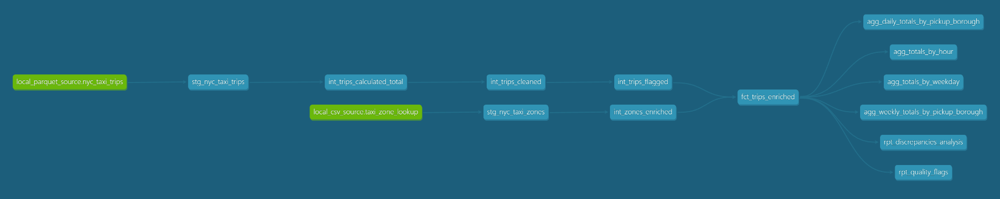

# Modern Data Stack - nyc_taxi_trips (dbt + DuckDB)

[](https://www.getdbt.com/)
[](https://duckdb.org/)
[](https://motherduck.com/)
[](https://github.com/tomszy91/nyc_taxi_trips/actions/workflows/dbt_build.yml)
[](LICENSE)

A dbt portfolio project built on NYC Taxi & Limousine Commission (TLC) Yellow Taxi trip data. The pipeline transforms raw monthly Parquet files into analytics-ready mart tables, with incremental loading designed for recurring monthly uploads and automated execution via GitHub Actions.

**Stack:** dbt 1.10 · dbt-duckdb · MotherDuck (cloud) · GitHub Actions

---

## Business context

The project simulates an analytics engineering task for a taxi fleet operations team. Raw trip data from vendor systems arrives as monthly Parquet dumps loaded into a MotherDuck raw table. The pipeline delivers clean, documented, tested models that answer the following business questions without any further transformation in the BI layer:

- What is daily and weekly revenue by pickup borough?
- Which hours and days of the week generate the most revenue?
- Where do financial discrepancies between reported and calculated fares come from, and are they vendor-specific?
- What share of trips carry data quality flags (suspicious activity, charge reversals)?

---

## Data sources

| Source | Format | Description |
| --- | --- | --- |
| `yellow_tripdata` | Parquet (monthly upload) | Raw trip fact records published monthly by NYC TLC, loaded into MotherDuck raw schema |
| `taxi_zone_lookup` | CSV | Reference table mapping LocationID to borough, zone, and service zone |

Raw data: [NYC TLC Trip Record Data](https://www.nyc.gov/site/tlc/about/tlc-trip-record-data.page)

---

## Project structure

```bash
models/
  staging/
    trips/
      stg_nyc_taxi_trips.sql                        -- rename, cast, generate surrogate key
      int_trips_calculated_total.sql                -- recalculate total from components, derive discrepancy
      int_trips_cleaned.sql                         -- remove physical outliers (speed, distance, time), deduplicate [incremental]
      int_trips_flagged.sql                         -- flag suspicious trips and charge reversals, add duration/speed
    zones/
      stg_nyc_taxi_zones.sql                        -- rename, cast
      int_zones_enriched.sql                        -- handle LocationID 264/265, add zone_status flag
  marts/
    fct_trips_enriched.sql                          -- join trips with zones, main fact table [incremental]
    agg_daily_totals_by_pickup_borough.sql
    agg_weekly_totals_by_pickup_borough.sql
    agg_totals_by_hour.sql
    agg_totals_by_weekday.sql
    rpt_discrepancies_analysis.sql
    rpt_quality_flags.sql

macros/
  tests/
    not_negative.sql                                -- custom test: rejects negative values
    not_before_date.sql                             -- custom test: rejects timestamps before 1970-01-01

tests/
  assert_calculated_total_is_correct.sql            -- validates total recalculation formula (last 1 day)
  assert_int_trips_cleaned_unique_recent.sql        -- unique trip_id in last 35 days
  assert_flags_not_null_recent.sql                  -- is_suspicious and is_returned not null in last 35 days
  assert_average_speed_in_range_recent.sql          -- average_speed within 0-100 mph in last 35 days
  assert_flagged_rowcount_matches_cleaned_recent    -- row count parity between cleaned and flagged (last 35 days)

.github/
  workflows/
    dbt_build.yml                                   -- CI/CD: automated dbt build on push and monthly schedule
```

## Lineage



---

## Key design decisions

**Staging is rename-and-cast only.** No logic, no flags, no derived columns. This makes it trivial to swap the source format or add a new data provider without touching downstream models.

**Intermediate layer is split by responsibility.** Each `int_` model has one job: `int_trips_calculated_total` recalculates totals, `int_trips_cleaned` removes physical outliers, `int_trips_flagged` adds quality flags. Splitting them keeps the lineage readable and makes it possible to test each transformation step independently.

**Two incremental models with merge strategy.** `int_trips_cleaned` and `fct_trips_enriched` are materialized as incremental tables with `unique_key = 'trip_id'` and `incremental_strategy = 'merge'`. On each run, only records newer than the current table max (minus 1 day overlap) are processed through the intermediate view chain.

**Source freshness scans the raw table directly.** `dbt source freshness` runs a `max(tpep_pickup_datetime)` against `raw.yellow_tripdata` without any filter. DuckDB's columnar storage makes this fast enough for a monthly check. The source is configured with `on_error: continue` so a stale result is logged but does not fail the pipeline. In the GitHub Actions workflow, the freshness step runs with `continue-on-error: true` for the same reason — freshness is informational, not a hard gate.

**Singular tests are scoped to recent data.** Generic tests with `config.where` using `{{ this }}` do not resolve correctly in the dbt-duckdb adapter. All windowed tests are implemented as singular tests in `tests/` using `{{ ref() }}`, scoped to the last 35 days to keep test runtime proportional to the incremental window.

**Zone edge cases are handled in `int_zones_enriched`, not in the fact model.** LocationIDs 264 and 265 have special meaning in the TLC data dictionary (Unknown and Outside of NYC). The hardcoded mapping lives in one place; `fct_trips_enriched` does a clean join with no knowledge of those IDs.

**Suspicious trips and charge reversals are flagged, not removed.** `is_suspicious` and `is_returned` are boolean flags. The decision on whether to filter them sits with the business user in the BI layer, not in the pipeline. Both open decisions are documented inline in the YAML.

**`payment_discrepancy` is an explicit column, not a filter.** The difference between `total_amount` (vendor-reported) and `calculated_total_amount` (sum of components) is surfaced for every trip and aggregated in `rpt_discrepancies_analysis`. This makes vendor-specific logging defects visible rather than silently absorbed.

---

## Mart tables

| Model | Grain | Primary use |
| --- | --- | --- |
| `fct_trips_enriched` | One row per trip | Base fact table; slice by any dimension |
| `agg_daily_totals_by_pickup_borough` | Date x Borough | Daily revenue trend by area |
| `agg_weekly_totals_by_pickup_borough` | ISO Year-Week x Borough | Weekly revenue trend by area |
| `agg_totals_by_hour` | Hour of day (0-23) | Peak hour analysis |
| `agg_totals_by_weekday` | ISO day of week (1=Mon, 7=Sun) | Weekday vs weekend patterns |
| `rpt_discrepancies_analysis` | Vendor x Rate code x Payment type | Fare discrepancy audit |
| `rpt_quality_flags` | Vendor x Rate code x Payment type | Data quality audit |

---

## Data quality and testing

**Custom macros:**

- `not_negative` -- fails if any value in the column is below zero
- `not_before_date` -- fails if any timestamp predates 1970-01-01
- `update_watermark` -- called via `post_hook` on `int_trips_cleaned` to maintain the watermark table

**Packages used:**

- `dbt-labs/codegen` -- schema YAML generation during development
- `metaplane/dbt_expectations` -- extended column-level expectations

**Test coverage:**

- Source `not_null` and `accepted_values` on all key columns
- Referential integrity between trip zone IDs and the zone lookup table
- Source freshness via `max(tpep_pickup_datetime)` on raw table (warn after 40 days, error after 80 days)
- Unique `trip_id` on recent data (last 35 days) via singular test
- Row count parity between `int_trips_cleaned` and `int_trips_flagged` on recent data
- `is_suspicious` and `is_returned` not null on recent data
- `average_speed` within physical bounds (0-100 mph) on recent data
- `calculated_total_amount` formula correctness on last day of data

---

## Monthly data load workflow

The only manual step is loading a new Parquet file into MotherDuck before the scheduled pipeline run. Everything else is automated.

```python
import duckdb

con = duckdb.connect('md:')
con.execute("""
    INSERT INTO nyc_taxi_trips.raw.yellow_tripdata
    SELECT * FROM 'path/to/yellow_tripdata_YYYY-MM.parquet'
""")
```

The GitHub Actions scheduler fires on the first day of each month at 08:00 UTC. It first checks source freshness, then runs `dbt build` against the `prod` schema on MotherDuck.

On incremental runs, only records newer than the current table max (minus 1 day overlap) are processed through the transformation chain. A full rebuild from scratch can be forced with:

```bash
dbt build --full-refresh
```

---

## CI/CD

Automated via GitHub Actions (`.github/workflows/dbt_build.yml`).

| Trigger | When |
| --- | --- |
| Schedule | 1st of each month, 08:00 UTC |
| Push to `main` | On every commit merged to main |
| Manual | Via Actions tab (`workflow_dispatch`) |

The workflow installs dbt-duckdb, constructs `profiles.yml` from a GitHub Secret (`MOTHERDUCK_TOKEN`), runs `dbt deps`, checks source freshness (non-blocking), and executes `dbt build` against the `prod` schema. A failed test causes the workflow to exit with a non-zero code and triggers a GitHub email notification.

---

## Setup

**Requirements:** Python 3.12+, dbt-duckdb 1.10+

```bash
# Install dbt packages
dbt deps

# Configure MotherDuck connection in ~/.dbt/profiles.yml
# Profile name: nyc_taxi_trips
# Target: dev
# Type: duckdb
# Path: md:nyc_taxi_trips
# Token: read from MOTHERDUCK_TOKEN environment variable

# Create watermark table (one-time setup)
# Run in Python or DuckDB CLI:
# create table if not exists nyc_taxi_trips.raw._metadata_watermarks (
#     table_name varchar primary key,
#     last_meter_on timestamp
# );

# Check source freshness
dbt source freshness

# Build all models and run all tests
dbt build

# Generate and serve documentation
dbt docs generate && dbt docs serve
```

---

## Known limitations and open items

**`is_returned` flags both records in a charge/reversal pair.** The current implementation marks both the original charge and its reversal as `is_returned = true`. The correct treatment (deduplicate vs. keep both) is a pending business decision. See inline comment in `int_trips_flagged.sql`.
